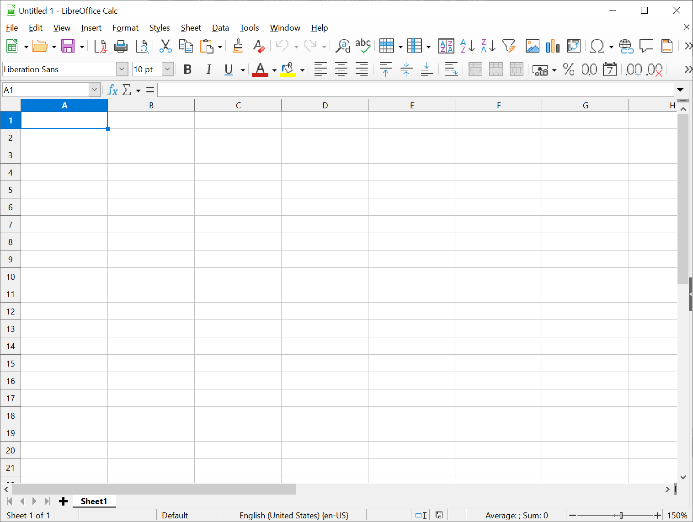
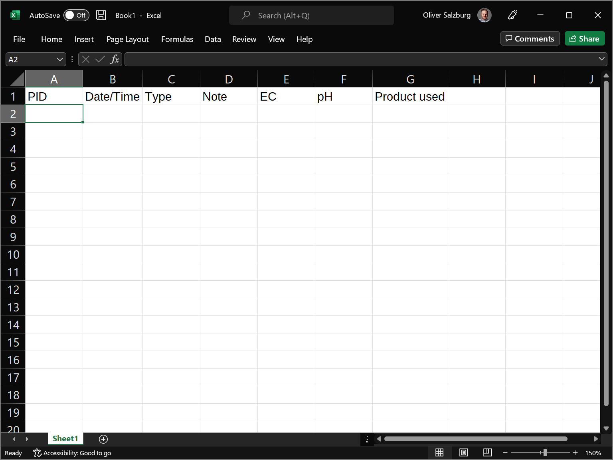
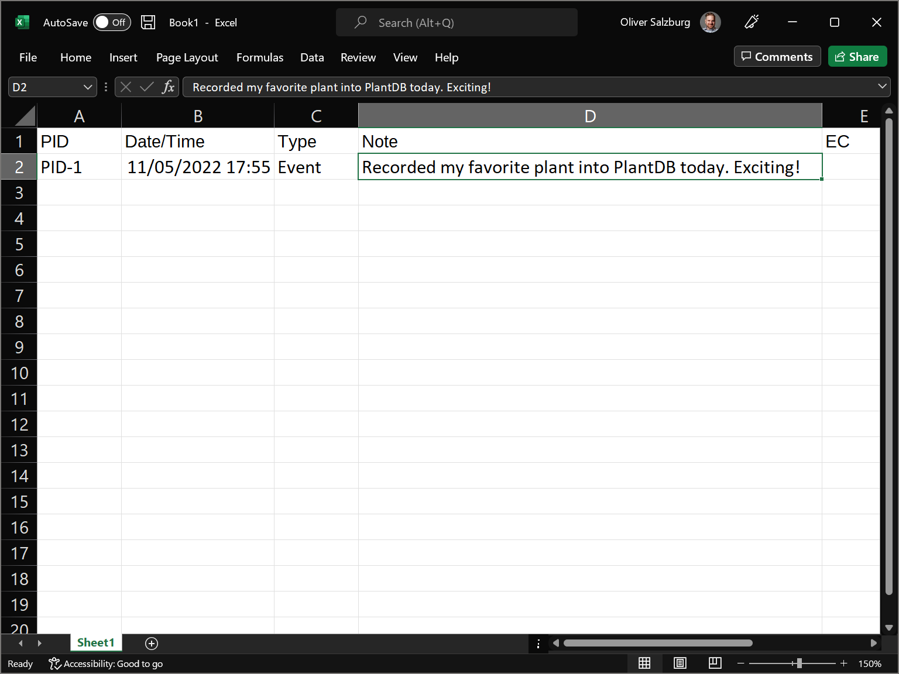

# Getting Started for Users

## What you will need

A spreadsheet authoring software. Common solutions are:

-   Microsoft Excel
-   LibreOffice Calc
-   Google Sheets

## Instructions

1.  Create a new workbook in your favorite spreadsheet application.

    === "LibreOffice Calc"

        

    === "Microsoft Excel"

        

    === "Google Sheets"

        

1.  Now add all the default columns that go into a PlantDB record log. Which are:

    -   PID
    -   Date/Time
    -   Type
    -   Note
    -   EC
    -   pH
    -   Product used

    !!! danger

        PlantDB is still in early developement. These are subject to change.

    Your sheet should now look something like this:

    === "LibreOffice Calc"

        

    === "Microsoft Excel"

        

    === "Google Sheets"

        

1.  Pick any of your plants. This is now the first plant you will take a record of. The first plant in your log will be `PID-1`. So put that in the first column under **PID** (cell `A2`).

    For the **Date/Time**, that would be _right now_. So enter the current date and time into cell `B2`.

    !!! note

        If you're recording older events and don't know the _excact_ time, it doesn't matter. Just be as precise as you can or want to be. When estimating the day, use `12:00:00` for the time. When estimating the entire year, use `01/01/1980 12:00:00`.

    !!! hint

        If you're using Microsoft Excel, you can use ++ctrl+semicolon++ and ++ctrl+shift+period++ as a series of keystrokes to have the current date and time entered into the cell.

        <small>Don't forget to add a space in between.</small>

1.  The **Type** would be the type of event this is. The easiest is to not think too much about it right now and just enter `Event` into cell `C2`. We'll get back to this later. Don't worry.

1.  The **EC**, **pH**, and **Product used** values can be safely ignored for now. Leave them empty.

1.  Last, but certainly not least, enter a note about this event. You could write:

    > Recorded my favorite plant into PlantDB today. Exciting!

    === "LibreOffice Calc"

         

    === "Microsoft Excel"

         

    === "Google Sheets"

         

1.  That's it! You now have a PlantDB-compliant record log of your plant data. Don't forget to save it! Keep on doing this for a while, try to remember old information, and extend your log.

    When you have a reasonable amount of data recorded, it's time to [import it into the playground](/plantdb/playground).

    !!! example

        Right now, you might want to look at the [event types](../reference/event-types.md) that are commonly used with PlantDB.
